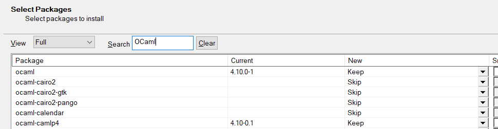
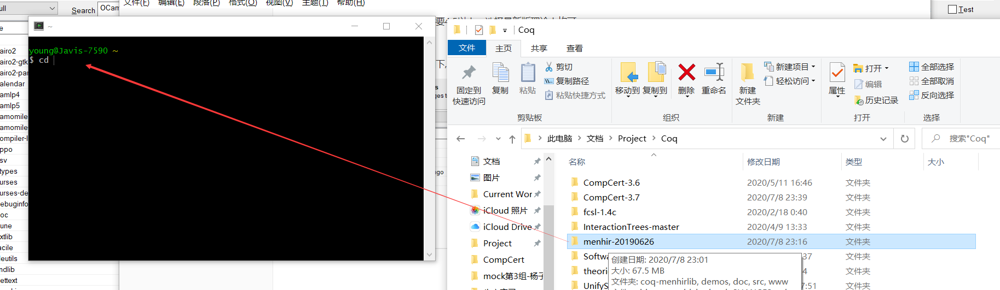
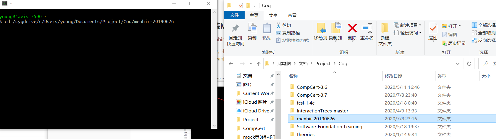

# CompCert-3.7  环境配置 Environment Configuration (Win10-Cygwin)

by Z. Yang

对CompCert 3.6应该同样适用, 大部分方法总结于CompCert的官网指导(Menhir的安装除外)

受中国大陆境内网络环境影响，Cygwin的安装步骤容易出现掉线导致一些失败，建议使用校园网络环境或者科学上网

在以下环境测试成功:

- CompCert3.7
- Menhir-20190626
- OCaml 4.10.0 in Cygwin


## 下载内容 Download

### CompCert源文件 CompCert Source Files

官网可以直接下载: http://compcert.inria.fr/download.html

---

Can be dowloaded from official websit: http://compcert.inria.fr/download.html


### Cygwin

Cygwin是一个能让windows系统使用Linux命令行语法以及Makefile的程序，Cygwin.exe 可直接到 http://www.cygwin.org/官网下载

---


### OCaml

和OCaml相关的内容均可在Cygwin安装时进行下载

---


### Menhir

Menhir 是一个语法分析器生成程序，可以在其开源地址下载到各个版本: https://gitlab.inria.fr/fpottier/menhir/-/tags

其中CompCert3.7 需要使用的最低版本为 20190626，更高版本理论上均可

---


## 安装内容 Installation

### 安装Cygwin并同时安装重要的程序

[注: 如果有遗漏，一般执行make的时候会有报错提示缺少什么]

打开下载得到setup-x86_64.exe, 一直点击下一步直到"Select Packages" 界面

在View处选择Full, 然后再在Search处搜索需要安装的包, 需要用到的如下:

- Ocaml：至少需要4.5以上，选择最新版理论上均可

- ocaml-findlib (或ocaml-find): 最新即可

- flexdll 最新即可
- ocaml-camlp4、ocaml-camlp5 (或camlp4、camlp5) 最新即可

以Ocaml为例如下, 只要把New那一列的选择改成对应的版本就行了(图中已经安装，所以是Keep):




然后一直下一步即可完成安装

---


### 编译并安装Menhir

[注: 仅使用Menhir-20190626进行了验证]

解压下载的Menhir文件到某个文件夹(无所谓哪个)，然后打开Cygwin, 把命令行的路径切换到那个目录下

最简单的操作为，打开cygwin, 然后输入cd，打一个空格，之后在Win10的文件资源管理器中打开一个文件，用鼠标把它拖到cygwin的窗口中，这个文件的目录就直接被拷贝进去了，再回车执行cd命令即可到达下载目录

如下图:







----


然后分别执行以下两行命令，第一行为编译Menhir，第二行为安装Menhir

```shell
make -f Makefile PREFIX=/usr/local USE_OCAMLFIND=true all
make -f Makefile PREFIX=/usr/local install
```

执行完第二行以后，Menhir就已经被安装到了环境变量中，可以通过命令

```shell
menhir --version
```

来查看是否安装成功，如果成功，将会显示

```
menhir, version 20190626
```

---


### 编译CompCert-3.7

在确保Menhir安装完成以后，解压CompCert源代码的压缩包，同样打开Cygwin并切换到对应的目录下

测试是否所有前置环境已经正常

```shell
./configure x86_32-cygwin
```


然后直接执行 make:

```shell
make all
```

或者在多核电脑上执行(以8核为例): 

```shell
make -j8 all
```


如果一切顺利，可以看到它首先编译了一串*.v文件，然后编译了一串 *.ml / *.mli文件

---

